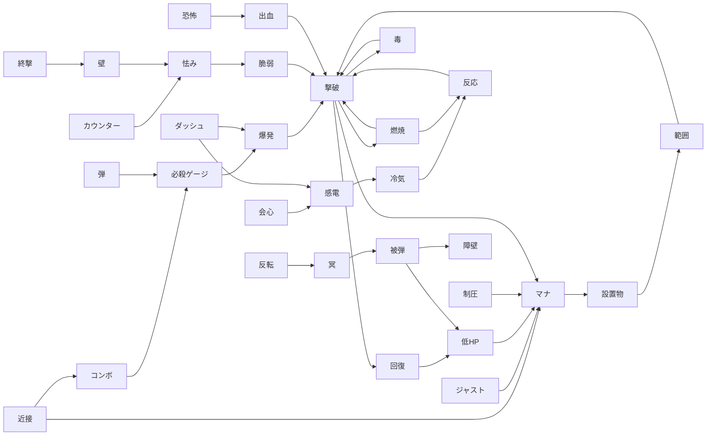

# 横断シナジーの網（共通語彙・連鎖・原型）

作成日: 2026-09-24
前提: `docs/DESIGN_PRINCIPLES.md`、`IDEAS.md`「現状」、`docs/COMBAT_DESIGN.md`（E 章 状態異常）、`docs/LOOT_DESIGN.md`（色と共鳴）、`docs/ideas/build-diversity.md`（3 章 文法拡張・4 章 シナジー網）、`src/loot/affixes.ts` / `src/loot/triggers.ts` / `src/system/boons.ts` / `src/skills/data.ts` / `src/core/status.ts` を読んだ。
今の実装: タグは **4 系統がばらばら**（性質の tags 18 種・祝福の `BoonTag` 20 種・スキルの `SkillTag` 11 種・状態異常 13 種）。橋は `equipmentTags`（stats → `BoonTag` を推論して祝福の抽選重みに使う）だけ。トリガー文法は装備の `tr:` だけが持ち（trigger 8 × condition 6 × effect 11、ICD 0.4 秒）、祝福はフック関数の直書き、スキルは `applies` で状態異常を渡すだけ。
凡例: コスト S = 数時間 / M = 1〜2 日 / L = 数日以上。面白さ ★1〜5

## 0. この文書の新語（`docs/GLOSSARY.md`「設計上の用語」に足す）

| 表記 | 意味 |
| --- | --- |
| 語（キーワード） | 全要素が共有するシナジーの単位。1 要素は複数の語を持つ。内部名 `Keyword` |
| 出す / 食う / 強める | 語への関わり方の 3 動詞。出す = その状況を作る、食う = その状況を条件・燃料にする、強める = 出した結果の量や質を上げる |
| 環 | 出す → 食う の連鎖が 3 要素以上で元の語へ戻る閉路。ビルドの「エンジン」 |
| 余り / 飢え | 余り = 出しているのに誰も食わない語。飢え = 食うのに誰も出さない語。UI でビルドの穴を示す |
| 連携 | 環や反応が実際に 1 回回ったこと。図鑑に記録する単位 |
| 連鎖深さ | 効果が別の効果を起こした段数。0 = 操作が直接起こしたもの |
| 過熱 | 使うほど溜まり、満ちると不利が起きるラン内ゲージ（6 章の代償） |
| 鏡 | 自分が得たルールが敵側にも同じ形で効く代償（6 章） |
| 原型 | 核となる環を中心にしたビルドの型（7 章） |

## 1. 共通語彙（40 語）【実装済み 2026-09-24】

実装済み: `src/core/keywords.ts`（`KEYWORDS` / `KEYWORD_DEFS` / `kw` / `mergeProfiles`）と `src/system/keywords.ts`（推論・`buildGaps`・`affinity`）。当初の案: 新規 `src/core/keywords.ts` に `KEYWORDS`（as const）/ `Keyword` / `KeywordProfile { produces; consumes; amplifies }`。表示は 1 文字の字形 + 色（状態異常の `STATUS_GLYPH` と同じ作り）。

### 1-1. 語の一覧

| # | 語 | key | 出す（例） | 食う（例） | 強める（例） |
| --- | --- | --- | --- | --- | --- |
| 1 | 近接 | melee | 近接の命中 | 近接命中時トリガー・弾返し | 近接威力・攻撃速度・筋力 |
| 2 | 射撃 | ranged | 射撃・弾の命中 | 射撃時トリガー・背面射撃 | 弾数・貫通・技巧 |
| 3 | ダッシュ | dash | ダッシュ開始 / 終了 | 帯電疾走・爆走・ダッシュ攻撃 | ダッシュ回数・距離・CD |
| 4 | ジャスト | just | ジャスト回避・パリィ成功 | 見切り斬り・見切りの息・回避一掃 | 受付時間・ジャストのダメージ |
| 5 | コンボ | combo | 連続ヒット | 連撃波・コンボ燃料・雷極 | コンボ受付時間・堅実な手 |
| 6 | 終撃 | finisher | 3 段目の斬撃 | 断裂波・everyNth 系 | 終撃のみ・3 段目の怯み値 |
| 7 | カウンター | counter | 予備動作中の命中 | ガードブレイク・（新）カウンター時トリガー | 怯み値 ×2 の倍率 |
| 8 | 静止 | still | 移動入力なし・チャネル中 | 静止狙撃・（新）stationary 条件 | 回転弾幕・地裂きの溜め |
| 9 | マナ | mana | マナ回収（命中・撃破・ジャスト） | スキルのマナ消費 | 最大マナ・コスト軽減・精神 |
| 10 | 必殺ゲージ | energy | ゲージ獲得 | バースト・過充填・fullEnergy 条件 | ゲージ獲得量・バースト範囲 |
| 11 | 低HP | lowHp | 自傷（血の代償・過駆動・過負荷） | belowHalfHp 条件・狂戦士・血の対価 | 最大 HP 減の誓約 |
| 12 | 回復 | heal | 命中 / 撃破で回復・ハート・泉 | 回復量で発動（新）・リゲイン | 回復量・吸血 |
| 13 | 被弾 | hurt | 敵の攻撃を受ける | 被弾時トリガー・棘・森極 | 被ダメ軽減（被弾を長く続けられる） |
| 14 | 障壁 | ward | 無敵・勝利の帳・（新）shieldCharge | 障壁中の条件（新） | 無敵時間・障壁の回数 |
| 15 | 燃焼 | burn | 燃焼の付与 | 野火・業火の心・蒸発 | 燃焼 dps・霊力 |
| 16 | 冷気 | chill | 冷気の付与（5 で凍結） | 氷砕・凍て刺し・砕き | 冷気の遅さ・凍結時間 |
| 17 | 感電 | shock | 感電の付与（3 で麻痺） | 会心雷撃・霜雷 | 連鎖ダメージ・連鎖数 |
| 18 | 毒 | poison | 毒の付与 | 疫病・毒 × 出血 | 毒スタック上限 |
| 19 | 出血 | bleed | 出血の付与 | 血煙・毒 × 出血 | 移動を強いる効果（引き寄せ・恐怖） |
| 20 | 脆弱 | vulnerable | 脆弱の付与（崩し・撃ち抜き） | 脆弱 × 怯みの乗算 | 脆弱の倍率・持続 |
| 21 | 弱体 | weaken | 弱体の付与 | 弱体中の敵への条件（新） | 持続 |
| 22 | 恐怖 | fear | 恐怖の付与 | 逃げる敵への条件（新）・出血 | 持続（免疫 6 秒に縛られる） |
| 23 | 沈黙 | silence | 沈黙の付与（引力球） | 予備動作の取り消し | 持続 |
| 24 | 怯み | stagger | 怯み値の蓄積・怯み / ダウン | 崩し・damageVsStaggered | 怯み値・筋力 |
| 25 | 反応 | reaction | 蒸発・砕き・連鎖雷など状態異常同士の相互作用 | 反応時トリガー（新） | 反応のダメージ |
| 26 | 設置物 | placed | 地雷・雷撃・引力球・氷結地帯 | 設置物の上で起きる効果（新） | 設置数・持続 |
| 27 | 範囲 | area | 範囲攻撃の命中 | 巻き込み数で伸びる効果（新） | 拡大・範囲系の変異軸 |
| 28 | 弾 | bullet | 自弾と敵弾の存在 | 弾返し・bulletCut・回避一掃 | 弾速・貫通 |
| 29 | 爆発 | explode | 爆発（爆走・瞬歩・explodeOnKill・グレネード） | 爆発に巻き込まれた敵の条件（新） | 爆発半径 |
| 30 | 壁 | wall | 吹き飛ばし・壁叩きつけ | 壁叩きつけの追加効果 | ノックバック・壁際の狭い部屋 |
| 31 | 会心 | crit | 会心 | 会心雷撃・会心時恐怖 | 会心率・倍率 |
| 32 | 撃破 | kill | 敵を倒す | 撃破時トリガー・屠りの盃・野火 | 撃破が撃破を呼ぶ効果（連鎖深さで減衰） |
| 33 | 制圧 | clear | 封鎖 → 全滅 | 湧水・勝利の帳・roomLocked 条件 | 部屋の敵数・試練の波 |
| 34 | 大物 | elite | エリート・ボスとの戦闘 | 巨人殺し・宝物の鍵・エリート誘引 | エリート出現率 |
| 35 | 紅 | crimson | 紅の性質 | 灼極・紅の二重共鳴 | 色の重み（揺らぎ） |
| 36 | 蒼 | azure | 蒼の性質 | 氷極・蒼の二重共鳴 | 同上 |
| 37 | 翠 | jade | 翠の性質 | 森極・翠の二重共鳴 | 同上 |
| 38 | 金 | gold | 金の性質 | 雷極・金の二重共鳴 | 同上 |
| 39 | 冥 | umbra | 冥の性質・誓約・呪い付き祝福 | 虚極・冥の二重共鳴 | 反転（重み 2 倍） |
| 40 | 反転 | inverted | 反転した性質 | 虚極・（新）反転の数を数える効果 | 深度 13 以降の反転率 |

### 1-2. 既存タグとの対応

語にしないタグは「数値の軸」か「分類」で、網の節点にならないものに限る（damage / speed / utility / tradeoff / conversion / attribute / loot / buff）。

| 既存の系統 | 既存タグ → 語 |
| --- | --- |
| 性質 tags（`loot/affixes.ts`） | melee → 近接 / ranged → 射撃 / mobility → ダッシュ / combo → コンボ（justDodgeDamage は ジャスト）/ burst → 必殺ゲージ / critical → 会心 / life → 回復（lifeOn* / regen）/ defense → 被弾（thorns / damageTaken）・障壁 / elemental → key ごとに 燃焼・冷気・感電・爆発 / status → proc の kind ごと / mana・skill → マナ / damage・speed・utility・tradeoff・conversion・attribute → 語にしない |
| 祝福 `BoonTag` | melee・ranged・dash・just・combo・burn・chill・shock・explode・crit・poison・bleed・stagger・mana → 同名の語 / energy → 必殺ゲージ / hp → 低HP か 回復（定義ごと）/ room → 制圧 / boss → 大物 / loot・attr → 語にしない |
| スキル `SkillTag` | melee → 近接 / projectile → 射撃・弾 / area → 範囲 / movement → ダッシュ / defense → ジャスト（パリィ）/ placed → 設置物 / channel → 静止 / fire → 燃焼 / cold → 冷気 / lightning → 感電 / buff → 語にしない |
| トリガー `TriggerKind` | onMeleeHit → 近接を食う / onShoot → 射撃 / onKill → 撃破 / onJustDodge → ジャスト / onDash → ダッシュ / onHurt → 被弾 / onRoomClear → 制圧 / everyNthMeleeHit → 近接・コンボ |
| トリガー `TriggerCondition` | belowHalfHp → 低HP / comboAbove10 → コンボ / roomLocked → 制圧 / fullEnergy → 必殺ゲージ |
| トリガー `TriggerEffectKind` | shockwave → 範囲・壁 / spawnBullets → 弾 / chainLightning → 感電 / burnNearby → 燃焼 / freezeNearby → 冷気 / explode → 爆発 / heal → 回復 / energy → 必殺ゲージ / invuln → 障壁 / damageBuff・speedBuff → 語にしない |
| 状態異常 `StatusKind` | 各 kind → 同名の語（freeze は冷気、paralyze は感電、guarded は怯み）。相互作用の発生 → 反応 |
| 敵・部屋・フロア（新規付与） | 光線眼 → 燃焼・弾を出す / 浮遊眼・骸骨卿 → 弾を出す / 盾騎士 → カウンターを食う / 鬼火 → 爆発を出す / ゴーレム → 壁を出す / 暗闇 → 静止を強める / 洞窟 → 壁を強める / 試練 → 制圧・撃破を強める / 泉 → 回復を出す |

### 1-3. 案

| # | 案 | 中身 | なぜ面白いか | コスト | 面白さ | 触るファイル |
| --- | --- | --- | --- | --- | --- | --- |
| 1-a | 語の型【実装済み】 | `KEYWORDS` 40 語と `KeywordProfile`。字形・色・表示名を定義 | 4 系統のタグを 1 つの言葉で語れる | S | ★3 | 新規 `src/core/keywords.ts` |
| 1-b | 装備の語を推論【実装済み: `statsKeywords`。`equipmentTags` は同じ事実表を読むラッパー】 | `equipmentTags` を一般化した `buildKeywords(stats)`。性質ごとの手書きは不要 | 既存 63 性質が即座に網へ参加する | S | ★3 | `src/system/boons.ts`、新規 `src/system/keywords.ts` |
| 1-c | 明示の語【実装済み: 祝福・スキル石・刻印符・敵・部屋・フロア】 | 要追加: `BoonDef.keywords` / `SkillDef.keywords` / `ModifierDef.keywords` / `EnemyCombatDef.keywords` / `ROOM_KIND` の語 | 祝福・スキル・敵を同じ表で比べられる | M | ★3 | `src/system/boons.ts`、`src/skills/types.ts`、`src/skills/data.ts`、`src/data/enemyCombat.ts`、`src/system/roomTypes.ts` |
| 1-d | 全要素が 1 語以上のテスト【実装済み: 40 語すべてに出す・食う要素があることも検査】 | 語を持たない要素があれば失敗する | 足した要素が網から漏れない | S | ★2 | 新規 `src/system/keywords.test.ts` |

## 2. 出す → 食う グラフと環

### 2-1. 主な連鎖

### 2-2. 環 20

要素列の略号: 装 = 装備の性質 / 誓 = 誓約 / 遺 = 名のある遺物 / 共 = 共鳴 / ス = スキル石 / 符 = 刻印符 / 祝 = 祝福 / 状 = 状態異常の相互作用 / 敵・部 = 敵・部屋。数値は tuning の新節 `SYNERGY` に置く前提。

| # | 環 | 要素 | 回る条件 | 歯止め |
| --- | --- | --- | --- | --- |
| R1 | 燃焼 → 撃破 → 燃焼（延焼） | 装 燃焼 + 祝 野火 + 装 攻撃速度 | 密集した群れ（蝙蝠・伏兵部屋） | 延焼した燃焼は potency × 0.5^連鎖深さ。深さ 3 で止まる |
| R2 | 冷気 → 凍結 → 砕き → 冷気 | ス 氷結地帯 + 祝 凍て刺し + 祝 氷砕 | 3 体以上が近い | 凍結後の冷気免疫 3 秒・拘束上限・ボスは凍結しない |
| R3 | 感電 → 冷気 → 凍結 → 砕き → 怯み | ス 雷撃 + 装 冷気 + 状 感電 × 冷気 + 共 霜雷 | 感電の連鎖先がいる距離 | 麻痺後の感電免疫 3 秒・拘束上限 |
| R4 | 燃焼 × 冷気 → 蒸発 → 撃破 → 燃焼 | 共 蒸気 + 装 燃焼 + ス 氷結地帯 + 祝 野火 | 両方を交互に当てる操作 | 蒸発で両方消える（自分で積み直す手間が代償） |
| R5 | ジャスト → マナ → スキル → ジャスト | 祝 見切りの息 + ス パリィ + 符 反響 | 敵の攻撃が来続ける | パリィの CD・GCD。攻撃を受けに行く危険そのもの |
| R6 | コンボ → 必殺ゲージ → バースト → 撃破 → 必殺ゲージ | 祝 刻限コンボ + 祝 残響爆発 + 装 必殺ゲージ獲得 | 被弾しない | 刻限コンボの受付時間半減・バーストは撃破がないと還元なし |
| R7 | 低HP → コスト軽減 → スキル → 撃破 → 回復 → 低HP を抜ける | 祝 血の対価 + 符 血の代償 + 祝 屠りの盃 + 誓 狂戦士 | 回復しすぎない加減 | 自己矛盾型: 回復すると条件が切れる負のフィードバック |
| R8 | ダッシュ → 感電 → 撃破 → ダッシュ回復 | 祝 帯電疾走 + 誓 風走り + 新 effect `resetDash`（build-diversity 3-3） | 敵の中へ突っ込む | resetDash に ICD 1.0 秒・風走りの CD +50% |
| R9 | 設置物 → 引き寄せ → 爆発 → 撃破 → マナ → 設置物 | ス 引力球 + ス 地雷 + 符 連鎖 + 符 遅延 | 敵を 1 か所に集める読み | 設置物の同時上限・引力球は敵弾も寄せる（自分に来る） |
| R10 | 怯み → 脆弱 → 会心 → 怯み | 祝 崩し + 装 damageVsStaggered + 装 会心 + カウンター | 予備動作を読んで殴る | 堅守（怯み値半減）で同じ敵を固め続けられない |
| R11 | 出血 → 移動 → ダメージ → 撃破 → 回復 | ス 鎖鎌 + 装 ノックバック + 祝 血煙 + 装 出血 proc | 敵を動かす手段がある | 出血最大 3・移動距離が伸びないと空振り |
| R12 | 毒 → 撃破 → 毒の引き継ぎ → 撃破 | 装 毒 proc + 祝 疫病 + 符 呪い | 群れ・長い部屋 | 引き継ぎスタック −1・ボスは毒 0.3% |
| R13 | 敵弾 → 弾返し → 必殺ゲージ → 過充填 → 撃破 | 祝 弾返し + 祝 過充填 + 装 bulletCut + 敵 浮遊眼 | 射撃する敵がいる | 自分では燃料を作れない（敵依存）・近接敵だけの部屋で止まる |
| R14 | 被弾 → 棘 → 撃破 → 回復 → 被弾に耐える | 誓 不動 + 装 thorns + 共 森極 + 装 被弾時 invuln | 接触してくる敵 | 遠距離の敵には回らない・被ダメそのもの |
| R15 | 会心 → 連鎖雷 → 感電 → 麻痺 → カウンター不要の追撃 → 会心 | 祝 会心雷撃 + 装 会心 + 誓 賭博師 | 手数 | 麻痺後の感電免疫・賭博師の揺れ |
| R16 | 終撃 → 衝撃波 → 壁叩きつけ → 怯み → 終撃 | 祝 終撃のみ + 祝 断裂波 + 装 wallSlammer + 部 洞窟 | 壁のある地形 | 大部屋・ゴーレム（ノックバック無効）で止まる |
| R17 | 制圧 → マナ満タン → 開幕スキル → 速攻制圧 | 祝 湧水 + 祝 氷結封鎖 + 装 roomLocked 条件 + 部 試練 | 部屋を短く終える | 1 部屋 1 回。試練の 2〜3 波目は満タンなし |
| R18 | 静止 → 自然回復 → 回転弾幕 → 撃破 → 静止を保てる | 誓 静寂の誓い + ス 回転弾幕 + 祝 静止狙撃 | 敵を寄せ付けない | 露出型: 静止中は猪・盾騎士の突進に弱い |
| R19 | 恐怖 → 逃走 → 出血 → 撃破 → 恐怖 | 装 恐怖 proc（会心時）+ 装 出血 proc + 祝 疫病の変種（新、恐怖の引き継ぎ） | 会心が出る | 恐怖免疫 6 秒・ボスは恐怖無効 |
| R20 | 反転 → 冥の支配 → 虚極 → 被弾 → 来歴の被弾節目 → 芽 → 冥 | 装 反転 + 共 虚極 + 来歴と芽 + クラフト 煽り | ラン跨ぎ（深度 13 以降） | 虚極の被ダメ +10%・芽は反対色も出る |

### 2-3. 案

| # | 案 | 中身 | なぜ面白いか | コスト | 面白さ | 触るファイル |
| --- | --- | --- | --- | --- | --- | --- |
| 2-a | 連鎖深さ（実装済み 2026-09-24: 統一ルールの効果が起こしたイベントに適用。装備の `tr:` は深さ上限の打ち切りだけ） | 効果が起こした効果に深さを持たせ、深さ 3 で打ち切り、1 段ごとに × `SYNERGY.chainDecay`（0.5） | 環が回っても無限にならず、長い環ほど弱い | S | ★4 | `src/system/combat.ts`、`src/system/triggers.ts`、`src/data/tuning.ts` |
| 2-b | 延焼・引き継ぎの世代表示【実装済み 2026-09-24: 世代の型は持たず、source が env の状態異常を薄く描く】 | 延焼した燃焼・引き継いだ毒は点の色を薄くする | どこまで環が回ったか見える | S | ★3 | `src/render/statusUi.ts` |
| 2-c | 恐怖の引き継ぎ祝福 | R19 の欠けている 1 要素。恐怖の敵が死ぬと周囲 1 体に恐怖 | 出血と恐怖が環になる | S | ★4 | `src/system/boons.ts` |
| 2-d | resetDash / 反応時トリガー | build-diversity 3-3 の `resetDash` と新 trigger `onReaction` | R8・R3・R4 を装備だけで閉じられる | S | ★4 | `src/loot/triggers.ts`、`src/loot/types.ts`、`src/system/triggers.ts` |

## 3. 統一トリガー文法

実装済み（2026-09-24）: `src/core/events.ts`（`GameEvent` / `EventKind` 21 種 / `pushEvent`）、`src/core/rules.ts`（`Rule` / `RuleCondition` / `RuleEffect` / `EnemyRule`）、`src/system/rules.ts`（`resolveRules`。`step` の combo の後）、`SYNERGY`（`src/data/tuning.ts`）。装備の `tr:` は `ruleFromTrigger` で同じ文法に読み替え、発火は今まで通り `fireTrigger` がその場で行う（二重発火を避けるため resolveRules では集めない）。祝福 3 つ（野火・帯電疾走・屠りの盃）の Rule 版は `BOON_RULE_EXAMPLES`（`src/system/boonRules.ts`）に見本として置き、フックと同じ結果になることをテストで確かめた。`BoonDef.rules` への移し替え・共鳴 / 誓約 / 部屋の Rule・スキル命中の scope（どの発動の命中かの紐付け）は未着手

### 3-1. 型の形（要追加）

- `Rule` = `{ when: EventKind; if: Condition[]; then: Effect; chance; icd; scope; owner }`。今の `TriggeredEffect` は `if` が 1 つで `scope = any` の特殊形として読み替える
- `EventKind` = 今の `TriggerKind` 8 種 + build-diversity 3-1 の 11 種 + 新 `onReaction` / `onStatusApplied` / `onSkillCast` / `onSkillHit` / `onEnemyWindup` / `onEnemyDeath`
- `Condition` = 今の 6 種 + 3-2 の 12 種 + `targetHas: StatusKind` / `selfHas: StatusKind` / `recent: { kind; within }`（直近 N 秒に X があった）
- `scope` = `any` / `skill:<SkillKey>` / `slot:<n>`（スキル石・刻印符の Rule は自分の発動が起こしたイベントだけ食う）
- `owner` = `{ kind: "item" | "resonance" | "keystone" | "boon" | "skill" | "modifier" | "enemy" | "room"; key }`。図鑑の記録と UI の「誰が回したか」に使う
- 持ち主ごとの置き場: 装備は `tr:` のまま、祝福は 要追加: `BoonDef.rules`、スキル石は `SkillDef.rules`、刻印符は `ModifierDef.rules`、敵は `EnemyCombatDef.rules`、部屋は `ROOM_KIND` の `rules`

### 3-2. state に持つもの（要追加: `GameState.events` / `GameState.recent` / `GameState.ruleIcd`）

- `events: GameEvent[]`: 今ステップの出来事。`{ kind; actor; targetId?; keywords; depth; source }`。各 system は `pushEvent` で積むだけ（効果音の `pushSfx` と同じ作法）
- `recent: Record<EventKind, { lastTime; countInWindow }>`: 条件 `recent` と UI 用。窓は `SYNERGY.recentWindow`（3 秒）
- `ruleIcd: Map<ruleId, number>`: Rule ごとの内部 CD の残り。ruleId は owner + 添字で決まる（決定性）

### 3-3. 発火の順序

1. `step` の順（player → … → floor → reaper → combo）で各 system がイベントを積む
2. combo の後・effects の前に新ステップ `resolveRules` を 1 回。イベントを積んだ順に、Rule を固定順（装備スロット順 → 共鳴 → 誓約 → 祝福の取得順 → スキルスロット順 → 部屋 → 敵 id 順）で照合
3. 効果が出したイベントは深さ +1 で **次ステップ** へ持ち越す（同ステップで再帰しない。決定的で、暴走しても 1 ステップに 1 段）
4. 深さ `SYNERGY.maxDepth`（3）以上のイベントは Rule を起こさない。深さごとに効果量 × `chainDecay`
5. 乱数は Rule の照合順に `state.rng` から引く。リプレイは今のまま再現する

### 3-4. ICD の 3 層

- Rule ごと: 既定 `TRIGGER` の 0.4 秒。高頻度の when（近接命中・射撃）は長め
- 語ごと: 1 秒あたり同じ語の効果を起こせる回数に上限（`SYNERGY.keywordBudget`）。環を 2 本重ねても爆発が倍にならない
- 敵ごと: 既存の `StatusBag.procIcd` をそのまま使う

### 3-5. 敵と部屋の Rule

- 敵の Rule の効果は **必ず予告付きのハザード** に限る（例: 爆裂のエリートの死亡爆発を 0.6 秒の予告付きに）。テレグラフ原則を文法で強制する
- 敵の Rule も同じ語を出す。燃える敵が死ぬとプレイヤーの野火も起こる、のように敵とプレイヤーの環が交わる

### 3-6. 案

| # | 案 | 中身 | なぜ面白いか | コスト | 面白さ | 触るファイル |
| --- | --- | --- | --- | --- | --- | --- |
| 3-a | イベント列（実装済み） | `events` / `recent` / `pushEvent`。既存の `triggers.ts` 呼び出しをイベント経由へ | trigger を 1 つ足す手間が 1 行になる | M | ★3 | `src/core/state.ts`、`src/core/game.ts`、`src/system/triggers.ts`、`src/system/combat.ts` |
| 3-b | Rule 型と resolveRules（実装済み） | `TriggeredEffect` を Rule へ読み替える adapter。`tr:` の保存形式は変えない | セーブ互換のまま文法を全要素へ開ける | M | ★3 | `src/loot/types.ts`、`src/loot/triggers.ts`、`src/system/triggers.ts` |
| 3-c | 祝福の Rule 化（見本 3 つのみ） | 数値でもフックでもない「〜時: 〜」型の祝福（野火・疫病・氷砕・湧水・屠りの盃）を `BoonDef.rules` へ移す | 祝福と装備のトリガーが同じ表で重なる | M | ★4 | `src/system/boons.ts` |
| 3-d | スキル石の Rule | 例: 雷撃「このスキルで撃破時: 感電を周囲に 1」。変異軸と別に 1 つだけ持てる | 石の個体差が「何に噛むか」になる | M | ★4 | `src/skills/types.ts`、`src/skills/data.ts`、`src/skills/generator.ts` |
| 3-e | 刻印符の Rule | 例: 新刻印符「火口」= このスキルの命中が燃焼中の敵なら蒸発を起こす | 刻印符が装備の語と掛け算になる | M | ★4 | `src/skills/data.ts`、`src/skills/hit.ts` |
| 3-f | 敵の Rule | 爆裂 / 連結のエリート・鬼火の死亡爆発を Rule で書き、予告付きに統一 | 敵の爆発で自分の環が回る | M | ★3 | `src/data/enemyCombat.ts`、`src/system/elites.ts` |

## 4. シナジーの可視化 UI（数値・スコアを出さない）

| # | 案 | 中身 | なぜ面白いか | コスト | 面白さ | 触るファイル |
| --- | --- | --- | --- | --- | --- | --- |
| 4-a | 流れパネル【実装済み 2026-09-24: 装備画面の「網」タブ（`render/synergyUi.ts` / `ui/synergyPanel.ts`）。線ではなく 40 語のグリッドと、選んだ語を出す / 食う要素の列挙】 | 装備タブの共鳴パネル隣に、今のビルドが出す語（左列）と食う語（右列）を字形で並べ、つながる語を線で結ぶ。余りは左に取り残され、飢えは右で点滅。数や太さは出さない | 何が足りないかが「穴」で見え、次に拾う物の目的ができる | M | ★5 | `src/render/inventoryUi.ts`、`src/render/lootUiParts.ts`、新規 `src/system/keywords.ts` |
| 4-b | 遺物の「ここに噛む」【実装済み 2026-09-24: `describeSynergy`】 | ツールチップ末尾に「燃焼を出す → 野火（祝福）が食う」「飢えている 感電 を満たす」を 1〜2 行。今のビルドに関係する語だけ | 比較ではなく「何とつながるか」で選ばせる | S | ★4 | `src/loot/describe.ts`、`src/render/inventoryUi.ts` |
| 4-c | 祝福カードの印【実装済み 2026-09-24: 「出 / 食」の字形の行に加え、下段に 3 種の印（`BOON_MARK_LABEL`: 穴を埋める / 流れを太くする / 新しい流れ）を追加（2026-09-24 第 3 弾）】 | カード下に 3 種の印のどれか: 「流れを太くする」（余りを食う）/「穴を埋める」（飢えを満たす）/「新しい流れ」（どちらでもない）。並びは抽選順のまま | 選択の意味が読めるが優劣は出ない | S | ★4 | `src/render/boonUi.ts`、`src/system/boons.ts` |
| 4-d | スキル石の「この装備で変わる」【実装済み 2026-09-24: 「今のビルドと噛む」と連携の相手の行】 | スキル画面の石の説明に、装備の語が効く行を足す（「装備の感電: この石の命中でも起きる」「コンボ燃料: 今のコンボ受付時間なら維持しやすい」） | 同じ石が装備で別物に見える | S | ★4 | `src/render/inventoryUi.ts`、`src/skills/data.ts` |
| 4-e | 連携の瞬間表示【実装済み 2026-09-24: 連携名ではなく `state.chains` の語の並びを HUD 右下に 3 秒（`render/chainUi.ts`）。2026-09-24 第 3 弾で、並びが `NAMED_CHAINS`（12 種。延焼・誘爆など）に一致すれば頭に名前を添え、初めて見つけた連携は「新たな連携「〜」」を上に重ねて表示】 | 環が 1 周回ったら画面上部に連携名（「野火」「霜砕き」）を 1 秒。回数は出さない | 「今噛み合った」を体で覚える | S | ★4 | `src/render/renderer.ts`、`src/system/effects.ts` |
| 4-f | 語の色の統一 | 状態異常の色・共鳴の色・語の色を 1 つのパレットに寄せる | どの画面でも同じ色が同じ意味 | S | ★2 | `src/render/statusUi.ts`、`src/render/lootUiParts.ts` |

## 5. 相乗の発見を報酬にする

| # | 案 | 中身 | なぜ面白いか | コスト | 面白さ | 触るファイル |
| --- | --- | --- | --- | --- | --- | --- |
| 5-a | 連携図鑑【実装済み 2026-09-24: 図鑑の「反応」「連鎖」タブを「連携」1 頁へ統合（`CODEX_TABS` の `link`）。スキルの連携（`skills/combos.ts`）・状態異常の反応・2 語以上の連鎖の 3 系統を `src/meta/links.ts` の共通 id（`系統:key`）で扱い、初めて成立したランの階とシードを `CodexSave.firstSeen` に記録。発見 5 / 15 / 30 種の節目で図鑑の頁と称号（実績 `link5` / `link15` / `link30`）】 | 反応（蒸発・砕き・感電冷気…）と 2 章の環 20 を「連携」として登録。初めて回ると記録し、回した要素（owner）の名前も残す。未発見は語の字形だけ見せる | 次のランの目標が自然に生まれる | M | ★5 | 新規 `src/system/codex.ts`、新規 `src/ui/codexStore.ts`、`src/render/titleUi.ts` |
| 5-b | 連携の節目【実装済み 2026-09-24: 案の装備来歴（30 / 100 回）ではなく、発見数（3 系統の合計）の節目で実装（`src/meta/links.ts` の `linkMilestones` / `nextLinkMilestone` / `hasLinkPage`）。5 種で図鑑の頁、15 / 30 種で称号（実績 `link15` / `link30`）が開く】 | 装備中に同じ連携を 30 / 100 回回すと節目。芽の片方がその連携の欠けた語に寄る | 使い込んだ遺物が環に特化して育つ | S | ★4 | `src/loot/provenance.ts`、`src/loot/types.ts` |
| 5-c | 連携の銘【一部実装 2026-09-24: 銘の名詞候補への反映はまだ。代わりに、連携の初成立を図鑑の初発見の記録（階とシード。上の 5-a）に留めた】 | 銘の名詞候補に連携名を加える（「野火の燠牙」） | 遺物の名前が遊び方の記録になる | S | ★3 | `src/loot/names.ts` |
| 5-d | 手がかり枠【実装済み 2026-09-24: 祝福 3 択（と選択画面）に常時 1 件、今のビルドで成立し得る未発見の連携を片側伏せて出す（`render/boonUi.ts` の手がかり枠）】 | 祝福 3 択の 1 枠に確率で、図鑑の未発見の環のうち **今のビルドが既に 2 要素を持つもの** の欠けた 1 要素を出す。カードに「手がかり」印 | 発見が次の抽選を動かす。既知の型に固まらない | S | ★5 | `src/system/boons.ts` |
| 5-e | 発見の依頼【実装済み 2026-09-24: 依頼 5 件（未踏の連携 / 新しい反応 / 連携の型 / 糸の綾 / 網の目）。報酬は残響ではなく称号・図鑑の頁】 | ラン開始時に未発見の連携 1 つを依頼として提示。達成で残響（その環の色）を得る | 図鑑の穴埋めがクラフト素材になる | S | ★3 | 新規 `src/system/codex.ts`、`src/loot/crafting.ts` |
| 5-f | 称号の条件を図鑑に【実装済み 2026-09-24: 実績 4 件（連携の芽生え / 網の読み手 / 連携の賢者 / 型の極み）。称号は実績名をそのまま名乗る形】 | build-diversity 5 の称号の解放条件を「連携 N 種発見」「同じ連携 500 回」にする | 称号が遊んだ環の証になる | S | ★3 | 新規 `src/system/codex.ts` |

決定性の注意: 5-d のように図鑑が抽選に効くなら、リプレイは装備スナップショットと同様にラン開始時の図鑑スナップショットを持つ（要追加: `Replay.codex`、`src/core/replay.ts`）。実装した手がかり枠（`state.codexRun.links.hint`）は乱数を引かず、今のビルドから毎ステップ決定的に求めるので、この注意は該当しなかった。

## 6. 暴走の歯止め（代償の型 10）

強い環には下のどれかを **必ず 1 つ** 付ける。どの型も「別の環では代償にならない」ように置き、単一の最強構成を作らない。

| # | 型 | 中身 | 付ける例 | 触るファイル |
| --- | --- | --- | --- | --- |
| C1 | 排他 | 同じグループの誓約・祝福は 1 つ（既存の誓約グループを祝福にも） | 風走り と 瞬歩（style）/ 静止狙撃 と 疾走射撃 | `src/loot/affixes.ts`、`src/system/boons.ts` |
| C2 | 低下 | 得る軸と別の軸が下がる | 虚ろの器・硝子の砲 | 既存 |
| C3 | 変換 | 元の軸の盛りを失い別の軸へ移す | 変換 10 種・持ち替え | 既存 |
| C4 | 不安定化 | 効果量が振れる | 賭博師・揺らぎ | 既存 |
| C5 | 鏡 | 得たルールが敵にも効く（新）。例: 野火の延焼は敵由来の燃焼の死でもプレイヤー側へ延びる | R1・R12 の強い版の呪い付き祝福 | `src/system/boons.ts`、`src/system/statusEffects.ts` |
| C6 | 消費 | 溜めたものを使うと 0 に戻る | コンボ燃料・蒸発（両方消える） | 既存 |
| C7 | 世代減衰 | 連鎖深さごとに × 0.5、深さ 3 で打ち切り | 全ての環 | 3-a / 2-a |
| C8 | 語の逓減 | 同じ語を出す源が増えるほど 1 源あたりが弱まる（build-diversity 1-1 を語単位に） | 燃焼を 4 源から出しても 2 源分強くはならない | `src/loot/stats.ts`、新規 `src/system/keywords.ts` |
| C9 | 過熱 | 環が回るたびにゲージが溜まり、満ちると 2 秒その語の効果が止まる（新、表示あり） | R6・R9 の強い祝福 | 要追加: `GameState.overheat`、`src/system/boons.ts` |
| C10 | 露出 | 環を回す間に隙ができる（静止・溜め・チャネル・設置の手間） | R18・地裂き・溜め | 既存 |

補足: 回復で条件が切れる R7 のような「自己矛盾」は代償を足さずに済む形なので、低HP 系の新要素はまずこの形で設計する。

## 7. ビルド原型 24

| # | 原型 | 核の環 | 序盤の入口 | 中盤の伸ばし方 | 弱点・天敵 | 混成例 |
| --- | --- | --- | --- | --- | --- | --- |
| A1 | 野火使い | R1 燃焼 → 撃破 → 延焼 | 燃焼の性質の武器 | 野火 + 業火の心 + 攻撃速度・紅の支配 | 単体の大物（延焼先が無い）・ボス階 | A4 蒸気術師・A15 疫病医 |
| A2 | 氷砕き | R2 冷気 → 凍結 → 砕き | 氷結地帯 | 凍て刺し + 氷砕 + 拡大 | ボス（凍結しない）・冷気免疫の 3 秒 | A3 霜雷・A7 終撃主義 |
| A3 | 霜雷 | R3 感電 → 冷気 → 凍結 | 雷撃 | 蒼金の霜雷共鳴 + 冷気 proc | 散開する敵（連鎖が届かない）・蝙蝠 | A18 会心雷 |
| A4 | 蒸気術師 | R4 燃焼 × 冷気 → 蒸発 | 紅蒼の蒸気共鳴 | 燃焼と冷気を別の手段（近接と設置物）で分担 | 両方の手段を失う沈黙（浮遊眼） | A1・A2 |
| A5 | 見切り手 | R5 ジャスト → マナ → スキル | 見切りの息 | 硝子の見切り・justDodgeDamage・パリィ | 攻撃してこない部屋・拘束の少ない雑魚群 | A6 弾返し |
| A6 | 弾返し | R13 敵弾 → 必殺ゲージ → 過充填 | 祝福 弾返し | 過充填 + bulletCut + 必殺ゲージ獲得 | 近接敵だけの部屋・猪 | A5・A21 |
| A7 | 終撃主義 | R16 終撃 → 衝撃波 → 壁 → 怯み | 祝福 終撃のみ | 断裂波 + wallSlammer + 筋力 | 大部屋・ゴーレム | A8 壁職人・A17 崩し屋 |
| A8 | 壁職人 | R16 の壁寄り（吹き飛ばし → 壁叩きつけ） | ノックバックの性質 | 鎖鎌で引き戻して再び叩きつけ・洞窟階 | 開けた部屋・ノックバック無効 | A7・A11 |
| A9 | 血の契約者 | R7 低HP → コスト軽減 → スキル → 回復 | 血の対価 | 狂戦士 + 刻印符 血の代償 + 屠りの盃 | 毒・出血の継続ダメージ（加減が崩れる） | A10・A20 |
| A10 | 渇き剣士 | 近接 → マナ（×3）→ 旋風斬り → コンボ | 渇きの誓約 | コンボ燃料 + 攻撃速度 | 近づけない敵（光線眼） | A21 必殺循環 |
| A11 | 静寂の砲台 | R18 静止 → 自然回復 → 回転弾幕 | 静寂の誓い | 静止狙撃 + 貫通 + 回転弾幕 | 猪・盾騎士の突進・死神の圧 | A12 地雷原 |
| A12 | 地雷原 | R9 設置物 → 引き寄せ → 爆発 | 地雷 | 引力球 + 遅延 + 連鎖 | 壁抜けの鬼火・速い蝙蝠 | A14 瞬歩爆撃 |
| A13 | 雷走り | R8 ダッシュ → 感電 → 撃破 → ダッシュ | 帯電疾走 | 風走り + resetDash の性質 | 単体の硬い敵（撃破が起きない） | A3・A18 |
| A14 | 瞬歩爆撃 | ダッシュ → 爆発 → 撃破 → 爆発（explodeOnKill） | 誓約 瞬歩 | 爆走 + 爆発半径 | 無敵が無い（爆弾ゴブリン・レーザー） | A12 |
| A15 | 疫病医 | R12 毒 → 撃破 → 引き継ぎ | 毒の性質 | 疫病 + 刻印符 呪い + 霊力 | ボス（毒 0.3%）・少数の部屋 | A16・A1 |
| A16 | 恐怖の狩人 | R19 恐怖 → 逃走 → 出血 | 会心時の恐怖 proc | 出血 proc + 恐怖の引き継ぎ（2-c）+ 会心 | ボス（恐怖無効）・恐怖免疫の 6 秒 | A18・A15 |
| A17 | 崩し屋 | R10 怯み → 脆弱 → 会心 | 祝福 崩し | damageVsStaggered + カウンター + 筋力 | 堅守・強靭の高い大物 | A7 |
| A18 | 会心雷 | R15 会心 → 連鎖雷 → 感電 → 麻痺 | 会心雷撃 | 会心率 + 金の支配（雷極）+ 賭博師 | 麻痺免疫・会心の出ない序盤 | A3・A16 |
| A19 | 封鎖速攻 | R17 制圧 → マナ満タン → 開幕 | 湧水 | 氷結封鎖 + roomLocked 条件のトリガー | 試練の 2〜3 波・伏兵の倍湧き | A12 |
| A20 | 棘の不動 | R14 被弾 → 棘 → 回復 | 誓約 不動 | thorns + 森極 + 被弾時 invuln | 遠距離の敵（光線眼・骸骨卿） | A9 |
| A21 | 必殺循環 | R6 コンボ → 必殺ゲージ → バースト → 還元 | 刻限コンボ | 残響爆発 + 必殺ゲージ獲得 + 堅実な手 | 被弾（コンボが切れる） | A6・A10 |
| A22 | 虚の器 | R20 反転 → 冥の支配 → 虚極 | 反転した遺物（深度 13 以降） | 煽りで反転を増やし、芽で冥を選ぶ | 被ダメ +10% と冥色以外の性質の減衰 | どの原型にも「冥の上乗せ」として混ざる |
| A23 | 両手使い | 近接 ↔ 射撃の往復でコンボ維持 | 祝福 持ち替え | hybrid 系の性質 + 射撃でコンボ維持（build-diversity 4-7） | どちらかを封じる誓約（剣の誓い / 不殺）と排他 | A10・A11 |
| A24 | 虹の旅人 | 散光共鳴で多くの語を浅く食う | 色が散った装備 | 手がかり枠（5-d）で毎ラン別の環に寄る | 突出した強みが無く大物に遅い | すべての原型の入口を試す準備段階 |

## 8. 実装ロードマップ（8 段階）

| 段階 | 中身 | 増える面白さ | コスト |
| --- | --- | --- | --- |
| 0 | 語の型（1-a）と GLOSSARY への追加 | まだ無い（言葉が揃う） | S |
| 1 | 既存要素へのタグ付け（1-b / 1-c / 1-d）。祝福の抽選重みを `BoonTag` 一致から語の「食う ↔ 出す」一致へ | 祝福が今の装備の余りを食う形で出やすくなる | M |
| 2 | 直近イベントの state（3-a）と Rule 型（3-b）。既存 `tr:` を移す | 新 trigger / condition（onCrit・onReaction・targetHas…）を安く足せる | M |
| 3 | 連鎖深さと減衰（2-a）、語の逓減（C8） | 環が回る手応えが出て、暴走しない | S |
| 4 | 祝福・スキル石・刻印符の Rule（3-c / 3-d / 3-e）と欠けた要素（2-c / 2-d） | 祝福と石と装備が同じ条件で掛け算になる | L |
| 5 | 敵・部屋の Rule（3-f） | 敵の死や部屋の仕掛けで自分の環が回る | M |
| 6 | UI（4-a〜4-f） | 何が噛み合っているかが見え、拾う目的ができる | M |
| 7 | 発見の報酬（5-a〜5-f） | 未発見の環が次のランの目標と抽選になる | M |

## 今すぐ入れるべき 5 つ

1. **語の型と装備の推論（1-a / 1-b）**: `equipmentTags` の推論をそのまま一般化でき、以降の全案の土台になる
2. **祝福カードの印（4-c）**: 祝福の抽選重みの計算（`boonWeight`）で既に一致を見ているので、表示を足すだけで「なぜこの 3 択か」が読める
3. **恐怖の引き継ぎ祝福と resetDash（2-c / 2-d）**: 疫病・帯電疾走の実装を流用して、R19・R8 の欠けた 1 要素を埋める
4. **連鎖深さと減衰（2-a）**: `isCompatible` の個別禁止（撃破 → 爆発など）を一般規則に置き換え、今後の環を安全に足せる
5. **遺物の「ここに噛む」行（4-b）**: `describe.ts` の行生成に 1〜2 行足すだけで、比較ではなくつながりで遺物を選ぶ UI になる
